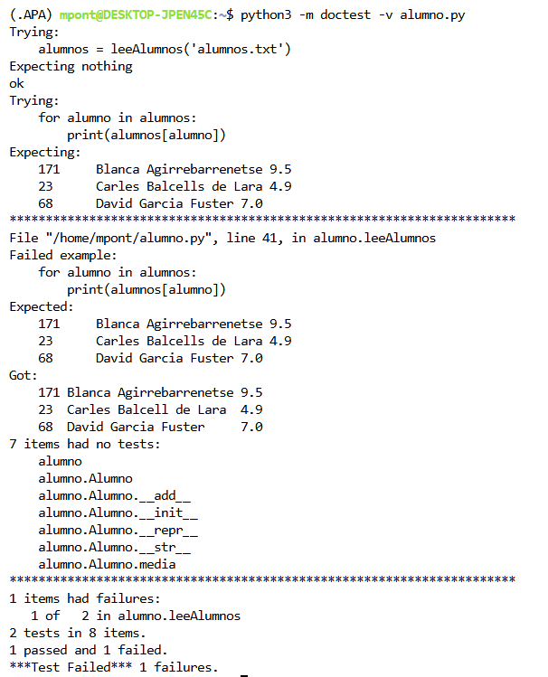

# Expresiones Regulares

## Alumne

**Pau Pont**

---

## Descripció

Aquesta pràctica consisteix en la resolució de dos problemes utilitzant expressions regulars en Python:

- Tractament de fitxers de notes d'alumnes.
- Normalització d'expressions horàries en llenguatge natural.

S'han desenvolupat els fitxers:

- `alumno.py`
- `horas.py`

seguint les especificacions de l'enunciat i fent servir expressions regulars per a l'anàlisi dels textos.

---

# Execució dels tests unitaris de `alumno.py`

La imatge següent mostra l'execució dels tests unitaris en mode verbós.



Per executar els tests s'ha utilitzat:

```bash
python3 -m doctest -v alumno.py
```

amb:

```python
if __name__ == "__main__":
    import doctest
    doctest.testmod(optionflags=doctest.NORMALIZE_WHITESPACE)
```

---

# Codi desenvolupat

## alumno.py

```python
"""
Pau Pont

Tractament de fitxers de notes d'alumnes.
Inclou la classe Alumno i la funció leeAlumnos().
"""

import re


class Alumno:
    """
    Clase usada para el tratamiento de las notas de los alumnos.
    """

    def __init__(self, nombre, numIden=-1, notas=[]):
        self.numIden = numIden
        self.nombre = nombre
        self.notas = [nota for nota in notas]

    def __add__(self, other):
        return Alumno(self.nombre, self.numIden,
                      self.notas + [other])

    def media(self):
        return sum(self.notas) / len(self.notas) if self.notas else 0

    def __repr__(self):
        return f'Alumno("{self.nombre}", {self.numIden!r}, {self.notas!r})'

    def __str__(self):
        return f'{self.numIden}\t{self.nombre}\t{self.media():.1f}'


def leeAlumnos(ficAlum):
    """
    Lee un fichero de alumnos y devuelve un diccionario cuya
    clave es el nombre del alumno y el valor el objeto Alumno.

    >>> alumnos = leeAlumnos('alumnos.txt')
    >>> for alumno in alumnos:
    ...     print(alumnos[alumno])
    ...
    171     Blanca Agirrebarrenetse 9.5
    23      Carles Balcells de Lara 4.9
    68      David Garcia Fuster 7.0
    """

    alumnos = {}

    patron = re.compile(
        r'^(\d+)\s+(.+?)\s+((?:\d+(?:\.\d+)?(?:\s+|$))+)$'
    )

    with open(ficAlum, encoding="utf-8") as fichero:

        for linea in fichero:

            linea = linea.strip()

            if not linea:
                continue

            coincidencia = patron.match(linea)

            if coincidencia:

                identificador = int(coincidencia.group(1))
                nombre = coincidencia.group(2)

                notas = [
                    float(nota)
                    for nota in re.findall(
                        r'\d+(?:\.\d+)?',
                        coincidencia.group(3)
                    )
                ]

                alumnos[nombre] = Alumno(
                    nombre,
                    identificador,
                    notas
                )

    return alumnos


if __name__ == "__main__":
    import doctest
    doctest.testmod(optionflags=doctest.NORMALIZE_WHITESPACE)
```

---

## horas.py

```python
"""
Pau Pont

Normalització d'expressions horàries utilitzant
expressions regulars.
"""

import re


def convertir_12h(hora, minuts, periode):

    if not (1 <= hora <= 12 and 0 <= minuts <= 59):
        return None

    if periode == "mañana":
        if 4 <= hora <= 12:
            return f"{hora % 12:02d}:{minuts:02d}"

    elif periode == "mediodía":
        if hora == 12:
            return f"12:{minuts:02d}"
        if 1 <= hora <= 3:
            return f"{hora + 12:02d}:{minuts:02d}"

    elif periode == "tarde":
        if 3 <= hora <= 8:
            return f"{hora + 12:02d}:{minuts:02d}"

    elif periode == "noche":
        if hora == 12:
            return f"00:{minuts:02d}"

        if 1 <= hora <= 4:
            return f"{hora:02d}:{minuts:02d}"

        if 8 <= hora <= 11:
            return f"{hora + 12:02d}:{minuts:02d}"

    elif periode == "madrugada":
        if 1 <= hora <= 6:
            return f"{hora:02d}:{minuts:02d}"

    return None


def normalizaHoras(ficText, ficNorm):

    def reemplazo_hora(match):

        hora = int(match.group(1))
        minuto = int(match.group(2))

        if 0 <= hora <= 23 and 0 <= minuto <= 59:
            return f"{hora:02d}:{minuto:02d}"

        return match.group(0)

    def reemplazo_hm(match):

        hora = int(match.group(1))

        if match.group(2):
            minuto = int(match.group(2))
        else:
            minuto = 0

        if 0 <= hora <= 23 and 0 <= minuto <= 59:
            return f"{hora:02d}:{minuto:02d}"

        return match.group(0)

    def reemplazo_frase(match):

        hora = int(match.group(1))
        expresion = match.group(2)
        periode = match.group(3)

        if expresion == "en punto":
            minuts = 0

        elif expresion == "y cuarto":
            minuts = 15

        elif expresion == "y media":
            minuts = 30

        elif expresion == "menos cuarto":
            hora -= 1

            if hora == 0:
                hora = 12

            minuts = 45

        else:
            return match.group(0)

        resultat = convertir_12h(hora, minuts, periode)

        return resultat if resultat else match.group(0)

    def reemplazo_simple(match):

        hora = int(match.group(1))
        periode = match.group(2)

        resultat = convertir_12h(hora, 0, periode)

        return resultat if resultat else match.group(0)

    with open(ficText, encoding="utf-8") as entrada, \
         open(ficNorm, "w", encoding="utf-8") as salida:

        for linea in entrada:

            linea = re.sub(
                r"\b(\d{1,2}):(\d{2})\b",
                reemplazo_hora,
                linea
            )

            linea = re.sub(
                r"\b(\d{1,2})h(?:([0-9]{1,2})m)?\b",
                reemplazo_hm,
                linea
            )

            linea = re.sub(
                r"\b(\d{1,2})\s*"
                r"(en punto|y cuarto|y media|menos cuarto)"
                r"\s+de la\s+"
                r"(mañana|tarde|noche|madrugada|mediodía)\b",
                reemplazo_frase,
                linea
            )

            linea = re.sub(
                r"\b(\d{1,2})\s+de la\s+"
                r"(mañana|tarde|noche|madrugada|mediodía)\b",
                reemplazo_simple,
                linea
            )

            salida.write(linea)
```

---

# Conclusions

S'han utilitzat expressions regulars per:

- Identificar i separar els camps dels alumnes.
- Detectar diferents formats horaris.
- Validar les hores correctes.
- Normalitzar-les al format estàndard `HH:MM`.

La implementació segueix els criteris indicats a l'enunciat i les recomanacions de la guia d'estil PEP8.
